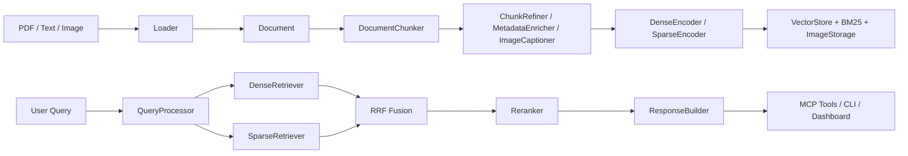

# Modular RAG MCP Server 面试拆解笔记

## 1. 项目一句话介绍

这是一个可插拔、可观测、可通过 MCP 对外暴露工具能力的模块化 RAG 系统。它覆盖了从文档摄取、混合检索、结果重排，到 Dashboard 可视化、评估回归、MCP 接入的完整工程链路。

适合用来证明三件事：

- 你不只是会调 API，而是能把 RAG 做成可维护系统。
- 你理解检索链路中的模块边界、可替换点和失败降级设计。
- 你知道如何把 AI 能力做成可观测、可测试、可交付的产品形态。

## 2. 为什么要做成模块化

### 核心原因

RAG 的问题从来不只是“回答对不对”，更是：

- 文档怎么进来
- 怎么切
- 怎么表示
- 怎么检索
- 怎么融合
- 怎么评估
- 怎么被外部系统调用

如果这些能力耦合在一个脚本里，后续替换任意一个组件都会导致联动修改，测试也无法做精确隔离。

### 这里的拆分方式

- `src/libs`
  - 抽象外部能力与第三方后端
  - 例如 LLM、Embedding、Splitter、VectorStore、Reranker、Evaluator
- `src/ingestion`
  - 负责离线摄取链路
  - 从 `Document` 到 `ChunkRecord`
- `src/core/query_engine`
  - 负责在线检索链路
  - 从 query 到 retrieval results
- `src/mcp_server`
  - 负责协议层与工具暴露
- `src/observability`
  - 负责 trace、dashboard、evaluation

这套分层的好处是：

- 能单测每个能力
- 能 mock 外部依赖
- 能替换 provider
- 能在面试里讲清楚“接口稳定，后端可换”

## 3. 总体架构图

## 4. 摄取链路怎么讲

### 4.1 文件完整性检查

- 组件：`src/libs/loader/file_integrity.py`
- 项目内职责：对输入文件做 SHA256 去重

#### 在业内 RAG 里的作用

文件完整性检查是摄取系统的第一道门。它解决的不是“能不能读文件”，而是“这份内容值不值得重新处理”。在真实 RAG 系统里，embedding、图片处理、向量写入都不便宜，如果没有稳定去重机制，就会出现重复摄取、索引膨胀、评估结果漂移的问题。

#### 常见选型方案

- 按文件路径去重
  - 优点：实现最简单
  - 缺点：重命名后会误判为新文件
- 按文件修改时间去重
  - 优点：比纯路径多一个判断维度
  - 缺点：不稳定，时间戳容易误导
- 按内容哈希去重
  - 优点：最稳，能识别“同内容不同路径”
  - 缺点：需要读取文件并计算哈希
- 按业务主键去重
  - 优点：适合企业内部知识库、文档管理系统
  - 缺点：依赖外部系统提供稳定 ID

#### 本项目为什么这样选

这里选择内容哈希而不是路径去重，是因为它更符合“知识内容本身是主语义对象”的设计。这样即使文件重命名，只要内容没变也不会重复 ingest；如果文件被覆盖更新，哪怕路径不变也会触发重新处理。

面试表达：

> 我在 ingestion 入口先做内容哈希，而不是只按路径去重。这样即使文件重命名，只要内容没变也不会重复摄取；如果内容变化，即使路径没变，也会触发重新处理。

### 4.2 Loader 设计

- 抽象：`BaseLoader`
- 默认实现：`PdfLoader`

#### 在业内 RAG 里的作用

Loader 是“原始文档世界”到“统一语义对象世界”的转换器。它的核心任务不是单纯读文本，而是把不同格式的文档转换成统一契约，尽量保留结构、页码、图片、标题、引用位置等信息，为后续 chunking 和检索做准备。

在业内，Loader 是 RAG 成败的高风险点，因为很多检索质量问题其实不是 embedding 差，而是原始文档在进入系统时已经损失了结构。

#### 常见选型方案

- 纯文本抽取
  - 适合 TXT、Markdown、简单 PDF
  - 成本低，但结构丢失严重
- 基于 PDF parser 的结构抽取
  - 例如按页读取、提取图片、保留页码
  - 适合工程化 PDF RAG
- OCR 增强型 Loader
  - 适合扫描件、图片 PDF
  - 依赖 OCR，复杂度高
- Layout-aware Loader
  - 保留表格、段落块、版面信息
  - 适合高价值知识库，但成本明显更高

#### 本项目为什么这样选

项目当前选择的是“工程化 PDF parser + 图片占位符”路线，而不是一开始就上 OCR 或版面分析。原因是：

- PDF 是最常见的知识库输入格式
- 先把 `Document` 契约统一，比一开始追求最强解析更重要
- 多模态信息至少不能丢，所以在 `Document.text` 中插入 `[IMAGE: {image_id}]`，并在 `metadata.images` 保存路径和位置

当前约束的核心契约：

- 输出 `Document`
- 文本中图片位置插入 `[IMAGE: {image_id}]`
- `metadata.images` 保存 `path/page/text_offset/text_length`

这样做的价值：

- 后续 chunking 不需要知道图片怎么来的
- image caption 能准确回写或引用图片位置
- 多模态检索有统一中间表示

### 4.3 Chunking 设计

- 抽象层在 `src/libs/splitter`
- 业务适配层在 `src/ingestion/chunking/document_chunker.py`

#### 在业内 RAG 里的作用

Chunking 是 RAG 里最关键的效果杠杆之一。它直接影响三件事：

- 召回粒度
- 上下文完整性
- embedding 质量

业内经常说“RAG 的上限看检索，下限看切片”，原因就在这里。切得太小，语义断裂；切得太大，噪声变多、召回不准、模型上下文成本变高。

#### 常见选型方案

- Fixed Length Splitter
  - 按固定字符数或 token 数切
  - 优点：简单、稳定、最好控
  - 缺点：语义边界经常被打断
- Recursive Splitter
  - 按段落、换行、句号等层次逐级切
  - 优点：兼顾稳定性和一定语义边界
  - 缺点：不是真正语义级切分
- Semantic Splitter
  - 基于 embedding 或句向量做语义断点
  - 优点：理论上语义完整性更高
  - 缺点：实现复杂、成本高、可解释性弱
- Structure-aware Splitter
  - 按标题、章节、表格、列表等结构切
  - 优点：更适合规范文档
  - 缺点：依赖上游结构抽取质量

#### 本项目为什么这样选

当前默认选择 `RecursiveCharacterTextSplitter` 风格：

- 原因：实现简单、效果稳定、依赖轻、适合作为 MVP 默认值
- 代价：语义边界不够精细，长表格/跨段落上下文仍可能被切断

这里没有把切分逻辑写死在业务里，而是通过 splitter factory 管理，是因为 chunking 是后续最可能频繁调优的模块。面试时可以明确讲：

> 我没有把 chunking 写死成一个函数，而是把它做成可替换 provider。这样后续如果要从 recursive 切到 semantic，不需要改 ingestion 主链路，只需要替换 splitter 后端和配置。

### 4.4 Transform 设计

主要组件：

- `ChunkRefiner`
- `MetadataEnricher`
- `ImageCaptioner`

#### 在业内 RAG 里的作用

Transform 处于“原始 chunk”和“可检索 chunk”之间，它负责提升 chunk 的可用性，而不是重新定义 chunk。业内常见问题是：原始文档里有页眉页脚、噪声、图片、碎片化段落，如果直接 embedding，检索质量会明显下降。

#### 常见选型方案

- 纯规则清洗
  - 去空白、去页码、去页眉页脚
  - 优点：成本低、稳定
  - 缺点：泛化能力有限
- LLM Refine
  - 让 LLM 重写 chunk，使其更适合检索
  - 优点：效果可能更好
  - 缺点：成本高，且可能改写原意
- Metadata Extraction
  - 自动补标题、摘要、标签、实体
  - 优点：提升过滤与展示能力
  - 缺点：依赖规则或模型质量
- Image Captioning
  - 给图片补语义描述
  - 优点：多模态信息可参与检索
  - 缺点：Vision 成本高，且质量不稳定

#### 本项目为什么这样选

为什么把它们做成单独 transform，而不是直接塞进 chunker：

- 这三步的职责不同
- 便于单独开关和降级
- 便于比较“原始 chunk”和“增强后 chunk”的效果差异

具体价值：

- `ChunkRefiner`
  - 去页眉页脚、无意义分隔符、噪声
- `MetadataEnricher`
  - 生成 title、summary、tags，提升展示与过滤能力
- `ImageCaptioner`
  - 给图片增加可检索的文本语义

设计原则：

- LLM 增强永远是“可选的”
- 失败时降级为规则模式，不阻塞主链路

这是工程上很关键的一点，因为真实生产环境里最不稳定的通常就是外部模型调用。

### 4.5 Embedding 与存储

Dense + Sparse 同时保留：

- Dense
  - 语义召回强
  - 适合近义表达和语义匹配
- Sparse
  - 关键词精确召回强
  - 对专有名词、拼写、术语更友好

#### 在业内 RAG 里的作用

Embedding 的作用是把文本映射到可检索的向量空间；Sparse 表示则负责保留词项级匹配能力。真实业务里，query 既可能是自然语言问题，也可能是精确术语、错误拼写、产品编号、法规编号，所以很多成熟 RAG 系统不会只押注一种表示方式。

#### 常见选型方案

- Dense only
  - 优点：语义能力强
  - 缺点：术语和关键词命中不稳
- Sparse only
  - 优点：关键词命中精确、可解释性强
  - 缺点：语义泛化差
- Dense + Sparse Hybrid
  - 优点：覆盖更广，稳定性更高
  - 缺点：系统复杂度更高

向量库常见方案：

- Chroma
  - 本地友好，适合开发和 demo
- FAISS
  - 速度快，适合单机内存检索
- Milvus / Qdrant / Weaviate
  - 更偏服务化和生产部署
- PGVector
  - 适合与关系型数据强耦合的场景

Sparse 常见方案：

- BM25
  - 最常见、最经典
- SPLADE / learned sparse retrieval
  - 效果强，但复杂度更高
- Elasticsearch / OpenSearch 倒排检索
  - 适合大规模文档与生产系统

#### 本项目为什么这样选

为什么不是二选一：

- 只做 dense，容易漏掉强关键词命中
- 只做 sparse，容易丢掉语义近邻
- 混合召回是更稳妥的工程默认方案

为什么向量库选 `Chroma`：

- 本地易部署
- 开发体验轻
- 适合 demo、教学、面试项目
- 不需要额外独立服务

为什么 BM25 单独落一个 JSON 索引：

- 简单、透明、易调试
- 方便直接展示和测试
- 不把“搜索逻辑”和“向量库能力”绑死

## 5. 查询链路怎么讲

### 5.1 QueryProcessor

作用：

- query 标准化
- 提取 keywords
- 构造 filters

#### 在业内 RAG 里的作用

QueryProcessor 是“原始用户问题”到“检索请求”的中间层。它本质上是在做 query understanding。很多 RAG 项目忽略这一层，导致所有问题都直接送 embedding，最终让 dense 检索承担了本不该承担的职责。

#### 常见选型方案

- 纯规则处理
  - 小写化、去停用词、分词、提关键词
- LLM Query Rewrite
  - 把用户问题改写成更适合检索的形式
- HyDE
  - 先生成假设答案，再拿假设答案做检索
- 多路 query expansion
  - 为一个 query 生成多个变体一起召回

#### 本项目为什么这样选

当前实现偏规则和轻量结构化，因为项目目标首先是建立清晰、可测试的 query 层。它不追求最激进的 query rewrite，而是先把 query 标准化、关键词和 filters 分离出来，让后续 dense 和 sparse 两路都能复用。

### 5.2 DenseRetriever + SparseRetriever

#### 在业内 RAG 里的作用

Retriever 是召回层的核心。DenseRetriever 负责“相似语义找相似内容”，SparseRetriever 负责“词项匹配找显式命中内容”。它们是大多数混合检索系统的两条主干。

#### 常见选型方案

DenseRetriever 常见方案：

- 单塔 embedding + ANN vector search
- 双塔检索模型
- late interaction 模型，例如 ColBERT 类方案

SparseRetriever 常见方案：

- BM25
- Elasticsearch/OpenSearch
- learned sparse retrieval

#### 本项目为什么这样选

分开实现，而不是一个“大检索器”里硬写两套逻辑：

- 单一职责更清晰
- 便于分别评估召回效果
- 便于替换某一路后端

在面试里可以直接说：

> 我刻意把 dense 和 sparse 做成两个 retriever，而不是一个大函数，因为我要能独立观察两路召回效果，后续也方便单独下线或替换某一路。

### 5.3 Fusion 为何选 RRF

当前选择：Reciprocal Rank Fusion

#### 在业内 RAG 里的作用

Fusion 负责把多路检索结果合成一个稳定的候选集。Dense 和 sparse 的分数通常不在同一量纲上，直接线性相加很容易失真，所以业内经常引入更鲁棒的融合策略。

#### 常见选型方案

- Weighted Score Sum
  - 直接对不同检索器分数加权
  - 缺点是需要分数归一化和调参
- RRF
  - 只依赖排名，不依赖原始分值尺度
  - 工程鲁棒性高
- Learning to Rank Fusion
  - 训练一个融合模型
  - 效果潜力高，但成本和复杂度更高

#### 本项目为什么这样选

原因：

- 不依赖不同检索器分数的绝对尺度一致
- 比直接线性加权更稳
- 非常适合 dense/sparse 这种“分数语义不同”的融合场景

和加权求和对比：

- 加权求和
  - 需要校准分数范围
  - 更容易受某一路分数分布影响
- RRF
  - 只看排名
  - 工程鲁棒性更高

所以 RRF 适合 MVP 和多后端混合场景。

### 5.4 Reranker 为什么是可选层

#### 在业内 RAG 里的作用

Reranker 处在“粗召回”和“最终上下文”之间。它的任务不是扩大召回，而是把已经召回出来的候选重新排序，让最相关的内容进入最终上下文。很多高质量 RAG 系统的效果提升，主要就来自 reranker，而不是单纯换 embedding。

#### 常见选型方案

- 不做 rerank
  - 成本低、延迟低
  - 效果上限有限
- Cross-Encoder Rerank
  - 质量通常更好
  - 成本和延迟更高
- LLM-based Rerank
  - 灵活，能结合更复杂指令
  - 成本最高，稳定性更依赖模型

#### 本项目为什么这样选

原因很直接：

- 它通常最贵、最慢
- 但它往往能显著提升 Top-K 结果顺序质量

所以正确做法不是“默认强绑”，而是：

- 有预算/有质量要求时开启
- 没预算或失败时直接回退到 fusion 结果

这就是项目里 `fallback` 设计的意义。

## 6. 为什么要做 MCP Server

#### 在业内 RAG 里的作用

MCP Server 的作用不是“换一种 API 形式”，而是把知识库能力标准化成可供 AI 客户端直接调用的工具层。随着 AI 助手生态发展，RAG 系统越来越不只是服务终端用户，也服务其他智能体和开发工具。

#### 常见选型方案

- 只做 Web UI
  - 适合 demo
  - 不利于系统复用
- 只做 CLI
  - 适合开发验证
  - 不适合与 AI 工具生态直接集成
- HTTP API
  - 通用性强
  - 更适合传统服务调用
- MCP Server
  - 更适合给 Copilot、Claude、Codex 这类 AI 客户端消费

#### 本项目为什么这样选

这个项目不是要做一个对外公开 SaaS 网关，而是要把“本地知识服务能力”标准化地暴露给 AI 客户端。所以选择 MCP 非常合理。

面试表达：

> 我没有把检索能力只做成页面按钮，而是通过 MCP 协议包装成工具，使 AI 客户端能够用统一协议调用本地知识库。这一步把项目从 Demo 提升到了平台能力。

## 7. 为什么要做可观测性

#### 在业内 RAG 里的作用

可观测性在 RAG 里非常重要，因为问题来源往往很多：加载慢、chunk 不合理、embedding 不稳定、某一路 retriever 没命中、rerank 失败、外部 LLM 超时等。如果没有 trace 和日志，你很难判断是“模型不行”还是“系统链路有问题”。

#### 常见选型方案

- 纯日志打印
  - 简单，但不结构化
- 结构化 trace
  - 能看阶段耗时、输入输出概要
- Dashboard 可视化
  - 适合排障、演示、运营
- 接入外部 observability 平台
  - 如 LangSmith、OpenTelemetry、Axiom 等
  - 更适合生产，但部署和接入成本更高

#### 本项目为什么这样选

这里专门做了：

- `TraceContext`
- JSONL trace logger
- Ingestion traces
- Query traces
- Dashboard 可视化

这能解决什么问题：

- 是 load 慢，还是 split 慢
- 是 dense 召回差，还是 sparse 没命中
- rerank 有没有生效
- 哪个 query 的结果异常

面试里这是很加分的一点，因为它表明你不是只做 happy path。

## 8. 为什么要做评估体系

#### 在业内 RAG 里的作用

评估体系是 RAG 系统能否持续优化的基础。没有评估，你只能靠主观感觉调 chunking、embedding、rerank；有了评估，你才能知道改动到底提升了哪项指标，还是只是换了个错觉。

#### 常见选型方案

- 纯人工评估
  - 成本高，难回归
- 轻量规则/ID 命中评估
  - 例如 hit rate、MRR、Recall@K
  - 易回归，适合工程阶段
- LLM-as-a-judge
  - 评估回答质量、忠实度、相关性
  - 更贴近生成质量，但成本高
- 组合评估
  - 同时看召回指标和生成质量指标

#### 本项目为什么这样选

这里分两层：

- `CustomEvaluator`
  - 轻量、稳定、无额外依赖
  - 用于 hit_rate / mrr 等快速回归
- `RagasEvaluator`
  - 面向更丰富的质量指标
  - 适合接入更真实的 LLM 评估能力

为什么需要 `CompositeEvaluator`：

- 实际项目不会只看一个指标
- 召回类指标和回答质量指标要组合看

## 9. 为什么要做 Dashboard

#### 在业内 RAG 里的作用

Dashboard 本质上是 RAG 系统的“可操作控制台”。它不是为了展示漂亮界面，而是为了把数据、链路、评估和排障入口集中到一起，让开发、测试和演示都更高效。

#### 常见选型方案

- 不做可视化，只靠 CLI
  - 开发快，但可用性差
- Streamlit/Gradio 内部管理台
  - 搭建快，适合工具化和演示
- 前后端分离后台
  - 最灵活，但开发成本最高

#### 本项目为什么这样选

六个页面对应六类工作：

1. Overview
   - 看系统配置和规模
2. Data Browser
   - 看数据到底被摄取成了什么
3. Ingestion Manager
   - 直接上传/删除数据
4. Ingestion Traces
   - 看摄取耗时
5. Query Traces
   - 看检索耗时
6. Evaluation Panel
   - 运行回归评估

这里选 Streamlit，是因为目标是“快速做出可用控制台”，而不是产品级前端。对这个项目来说，速度、可复现性和演示成本比 UI 自由度更重要。

## 10. 关键选型与对比

### 10.1 为什么 Python

- LLM/RAG 生态成熟
- 文档处理和数据处理库丰富
- 测试、脚本、原型验证成本低

### 10.2 为什么 MCP 而不是直接 HTTP API

- HTTP API 更通用
- MCP 更适合“给 AI 工具链消费”

这个项目的目标不是做公开服务网关，而是做本地知识能力服务，所以 MCP 更贴合场景。

### 10.3 为什么 Streamlit

- 能快速搭出可用管理台
- 适合内部工具和演示
- 测试门槛低于完整前后端分离方案

缺点：

- UI 灵活性有限
- 不适合复杂交互产品化

如果是正式生产后台，我会考虑 React + FastAPI；但这个项目的目标是“验证链路 + 演示能力”，所以 Streamlit 是合理选型。

### 10.4 为什么不是 Elasticsearch / Milvus / PGVector

不是不能用，而是这里优先考虑：

- 本地起步成本
- 环境可复现性
- 面试演示稳定性

Chroma + JSON BM25 的组合更适合单机项目和教学展示。

### 10.5 为什么不是 LangChain 全家桶编排

这里借鉴了 LangChain 的接口思想，但没有把业务完全绑在框架上。

理由：

- 减少框架耦合
- 更容易解释每个模块做了什么
- 更容易为面试展示“我自己定义了契约和分层”

## 11. 你在面试里可以怎么讲项目难点

### 难点 1：多模态 PDF 的统一表示

文本、图片、页码、图片位置需要统一进一个 `Document` 契约，否则后续 chunking 和 response 组装会失控。

### 难点 2：Dense/Sparse 分数不可直接比较

这也是为什么选择 RRF，而不是简单把两个 score 相加。

### 难点 3：外部模型调用不稳定

LLM、Vision、Rerank 都可能失败，所以大量地方都做了 fallback。

### 难点 4：系统不是只要“能跑”，还要“可验证”

所以项目里补了：

- contract tests
- integration tests
- e2e tests
- dashboard smoke tests
- MCP subprocess tests

## 12. 常见面试问题答法

### Q1：你这个项目最核心的工程设计点是什么？

答：

> 我把 RAG 拆成了 provider 抽象层、离线摄取层、在线检索层、协议层、观测层五部分。这样一方面可以替换后端，另一方面可以对每层做独立测试和性能定位。

### Q2：为什么混合检索比单路检索更合适？

答：

> Dense 更擅长语义召回，Sparse 更擅长关键词精确匹配。实际业务 query 很杂，只押一种路线召回稳定性不够，所以我采用双路召回再用 RRF 融合。

### Q3：为什么要做 trace 和 dashboard？

答：

> RAG 最难的是定位问题，而不是写出 happy path。trace 能告诉我每个阶段做了什么、耗时多少，dashboard 让这些信息对开发和排障可见。

### Q4：如果让你把这个项目升级到生产，你会怎么改？

答：

1. 把本地 JSON/SQLite 类存储换成更稳健的服务型存储
2. 引入任务队列，把 ingest 做成异步
3. 加权限、租户隔离、限流
4. 把 dashboard 改成前后端分离
5. 完善真实评估集和线上反馈闭环

## 13. 项目亮点总结

你可以把亮点收敛成这 5 句：

1. 我做的不是单点 RAG Demo，而是一个可插拔的完整知识服务系统。
2. 我把摄取、检索、协议暴露、可观测、评估都打通了。
3. 我做了 Dense + Sparse + RRF + 可选 Rerank 的工程化混合检索方案。
4. 我为系统补了契约测试、集成测试和端到端测试，保证可以回归。
5. 我把能力通过 MCP 暴露出去，使它可以直接被 AI 助手调用。

## 14. 如何继续往上讲

如果面试官继续追问，可以顺着这三个方向展开：

- 工程深度
  - 讲抽象分层、fallback、trace、测试
- 检索效果
  - 讲 chunking、fusion、rerank、evaluation
- 产品化能力
  - 讲 dashboard、MCP、数据管理、可复现交付
